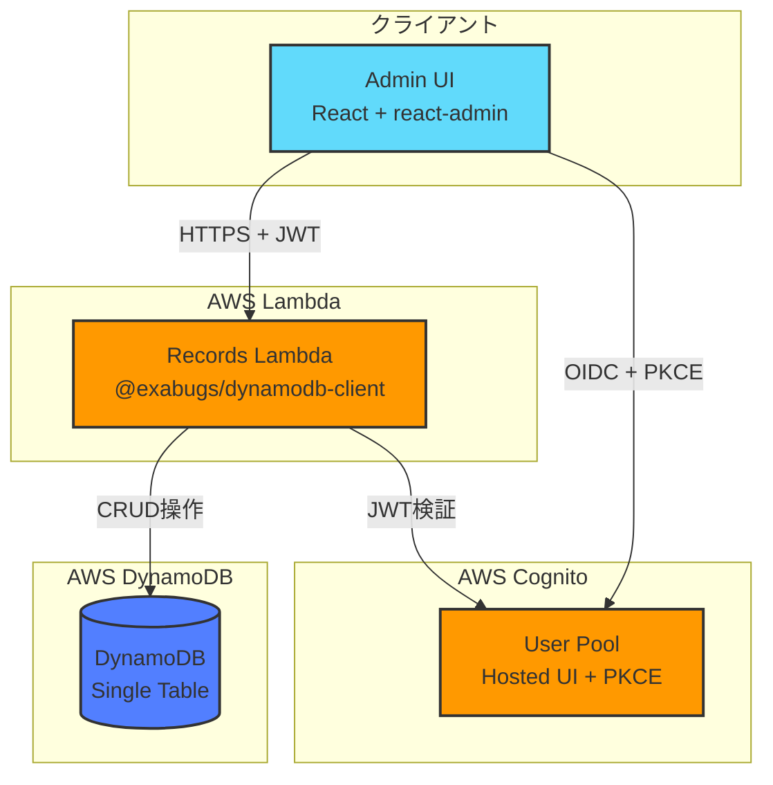

# 設計書

## 概要

`dynamodb-client-example` は、`@exabugs/dynamodb-client` パッケージの完全なワーキング例として、最小限かつ実用的な構成を提供します。以下の主要コンポーネントで構成されます：

- **データ層**: DynamoDB Single-Table設計による動的シャドー管理
- **API層**: Records Lambda (HTTP API) - `@exabugs/dynamodb-client` パッケージから提供
- **認証層**: Cognito User Pool + Hosted UI / OIDC + PKCE
- **クライアント層**: React管理画面（react-admin 5）
- **インフラ層**: Terraform IaC（workspace不使用、.tfvars管理）

本設計は、要件1〜10をすべて満たし、シンプルさ、保守性、セキュリティを重視します。

### 設計の強み

#### 1. Single-Table設計 + 動的シャドーレコード

**利点:**
- **GSI不要**: シャドーレコードによる柔軟なソート・検索（追加コストなし）
- **コスト最適化**: 未使用時は完全にゼロコスト（ストレージ費用のみ）
- **スキーマ柔軟性**: shadow.config.jsonでフィールドを動的に追加可能
- **パフォーマンス**: Query最適化により取得レコード数を最小化

#### 2. react-admin完全準拠のAPI設計

**利点:**
- **10操作完全対応**: getList, getOne, getMany, getManyReference, create, update, updateMany, delete, deleteMany, createMany
- **nextTokenページネーション**: DynamoDBのネイティブなページネーションを活用
- **無限スクロール**: クライアント側フィルタリングによる件数変動に対応

#### 3. セキュリティとコスト最適化

**利点:**
- **最小権限の原則**: Lambda関数ごとに独立したIAMロール
- **認証統合**: Cognito Hosted UI + JWT検証 + PKCE
- **コスト最適化**: Lambda Function URL、ARM64アーキテクチャ
- **型安全性**: TypeScriptによる型定義とエラーハンドリング

### AWSサービスマッピング

| 機能           | AWSサービス                      | 用途                       |
| -------------- | -------------------------------- | -------------------------- |
| HTTP API       | AWS Lambda Function URL          | クライアント向けAPI        |
| 認証           | Amazon Cognito                   | ユーザー認証・認可         |
| データベース   | Amazon DynamoDB                  | Single-Table設計           |
| コンピュート   | AWS Lambda (Node.js 22 ARM64)    | CRUD操作実行               |
| ログ           | Amazon CloudWatch Logs           | Lambda実行ログ             |
| トレーシング   | AWS X-Ray                        | 分散トレーシング           |
| IaC            | Terraform                        | インフラストラクチャ管理   |

## アーキテクチャ

### システム構成図



### ディレクトリ構成

```
dynamodb-client-example/
├── packages/
│   └── api-types/              # スキーマレジストリ（Single Source of Truth）
│       ├── src/
│       │   ├── models/
│       │   │   ├── Article.ts  # Article型定義 + スキーマ
│       │   │   └── Task.ts     # Task型定義 + スキーマ
│       │   ├── schema.ts       # SchemaRegistryConfig
│       │   └── index.ts        # エクスポート
│       ├── dist/               # ビルド成果物
│       ├── shadow.config.json  # 生成されたシャドー設定
│       ├── package.json
│       └── tsconfig.json
├── apps/
│   └── admin/                  # React + react-admin
│       ├── src/
│       │   ├── resources/
│       │   │   ├── articles.tsx
│       │   │   └── tasks.tsx
│       │   ├── App.tsx
│       │   ├── authProvider.ts
│       │   ├── dataProvider.ts
│       │   └── main.tsx
│       ├── .env.example
│       ├── package.json
│       ├── tsconfig.json
│       └── vite.config.ts
├── infra/                      # Terraform（workspace不使用）
│   ├── main.tf
│   ├── variables.tf
│   ├── outputs.tf
│   ├── envs/
│   │   ├── dev.tfvars
│   │   ├── stg.tfvars
│   │   └── prd.tfvars
│   └── modules/                # 必要に応じて
├── .envrc                      # AWS認証（gitignore）
├── .envrc.example              # 環境変数テンプレート
├── .gitignore
├── prettier.config.cjs         # Prettier設定
├── .prettierignore
├── eslint.config.js            # ESLint設定
├── Makefile                    # 共通操作
├── pnpm-workspace.yaml
├── package.json                # ルートpackage.json
├── tsconfig.base.json          # 共通TypeScript設定
├── vitest.config.ts            # テスト設定
└── README.md
```

## コンポーネント設計

### 1. packages/api-types（スキーマレジストリ）

**役割**: すべての型定義とスキーマの Single Source of Truth

**主要ファイル**:
- `src/types.ts`: 型定義と選択肢定義（ArticleStatus, TaskStatus, TaskPriority）- **Single Source of Truth**
- `src/models/Article.ts`: Article型定義 + ArticleSchema
- `src/models/Task.ts`: Task型定義 + TaskSchema
- `src/schema.ts`: SchemaRegistryConfig（全リソースを統合）
- `shadow.config.json`: ビルド時に自動生成

**型定義（Single Source of Truth）**:
```typescript
// src/types.ts
export type ArticleStatus = 'draft' | 'published' | 'archived';
export type TaskStatus = 'todo' | 'in_progress' | 'done';
export type TaskPriority = 'low' | 'medium' | 'high';

// 選択肢定義（Admin UI用）
export const ARTICLE_STATUS_CHOICES = [
  { id: 'draft', name: 'Draft' },
  { id: 'published', name: 'Published' },
  { id: 'archived', name: 'Archived' },
] as const;

export const TASK_STATUS_CHOICES = [
  { id: 'todo', name: 'Todo' },
  { id: 'in_progress', name: 'In Progress' },
  { id: 'done', name: 'Done' },
] as const;

export const TASK_PRIORITY_CHOICES = [
  { id: 'low', name: 'Low' },
  { id: 'medium', name: 'Medium' },
  { id: 'high', name: 'High' },
] as const;
```

**Article型定義**:
```typescript
import type { ArticleStatus } from '../types.js';

export interface Article {
  id: string;
  title: string;
  content: string;
  status: ArticleStatus;
  author: string;
  createdAt: string;
  updatedAt: string;
}

export const ArticleSchema: SchemaDefinition<Article> = {
  resource: 'articles',
  type: {} as Article,
  shadows: {
    sortableFields: {
      title: { type: 'string' as ShadowFieldType.String },
      status: { type: 'string' as ShadowFieldType.String },
      author: { type: 'string' as ShadowFieldType.String },
      createdAt: { type: 'datetime' as ShadowFieldType.Datetime },
      updatedAt: { type: 'datetime' as ShadowFieldType.Datetime },
    },
  },
};
```

**Task型定義**:
```typescript
import type { TaskStatus, TaskPriority } from '../types.js';

export interface Task {
  id: string;
  title: string;
  description: string;
  status: TaskStatus;
  priority: TaskPriority;
  dueDate: string;
  createdAt: string;
  updatedAt: string;
}

export const TaskSchema: SchemaDefinition<Task> = {
  resource: 'tasks',
  type: {} as Task,
  shadows: {
    sortableFields: {
      title: { type: 'string' as ShadowFieldType.String },
      status: { type: 'string' as ShadowFieldType.String },
      priority: { type: 'string' as ShadowFieldType.String },
      dueDate: { type: 'datetime' as ShadowFieldType.Datetime },
      createdAt: { type: 'datetime' as ShadowFieldType.Datetime },
      updatedAt: { type: 'datetime' as ShadowFieldType.Datetime },
    },
  },
};
```

**ビルドプロセス**:
1. `pnpm build` → TypeScriptコンパイル
2. `generate-shadow-config.js` 実行
3. `shadow.config.json` 生成（`packages/api-types/` 直下）

**参照方法**:
- Admin UI: `import { Article, Task, ARTICLE_STATUS_CHOICES, TASK_STATUS_CHOICES, TASK_PRIORITY_CHOICES } from '@example/api-types'`
- Terraform: `filebase64("../packages/api-types/shadow.config.json")`

**Single Source of Truth の徹底**:
- すべての型定義（ArticleStatus, TaskStatus, TaskPriority）は `api-types/src/types.ts` で string literal union として定義
- 選択肢定義（`*_CHOICES`）も同じファイルで定義し、Admin UIで直接使用
- enum は使用せず、軽量で tree-shakeable な string literal union を使用
- Records Lambdaでも同じ型定義を使用してバリデーション
- 文字列リテラルの重複を完全に排除

### 2. Records Lambda（@exabugs/dynamodb-client）

**役割**: DynamoDB CRUD操作を提供するHTTP API

**重要**: Records Lambdaのコードは `@exabugs/dynamodb-client` パッケージに含まれており、このリポジトリには含まれません。

**提供される機能**:
- MongoDB風API（find, findOne, insertOne, insertMany, updateOne, updateMany, deleteOne, deleteMany）
- Shadow Records自動管理
- Cognito JWT認証
- CORS設定
- エラーハンドリング

**デプロイ方法**:
Terraformで `@exabugs/dynamodb-client` のTerraformモジュールを参照：

```hcl
module "lambda_records" {
  source = "github.com/exabugs/dynamodb-client//terraform"

  project_name = "example"
  environment  = "dev"
  region       = "us-east-1"

  # DynamoDB設定
  dynamodb_table_name = "example-dev-records"
  dynamodb_table_arn  = module.dynamodb.table_arn

  # Cognito設定
  cognito_user_pool_id = module.cognito.user_pool_id

  # シャドウ設定（base64エンコード）
  shadow_config = filebase64("${path.root}/../packages/api-types/shadow.config.json")

  # ログ設定
  log_retention_days = 7
  log_level          = "INFO"
}
```

**環境変数**:
- `SHADOW_CONFIG`: base64エンコードされたshadow.config.json
- `COGNITO_USER_POOL_ID`: Cognito User Pool ID
- `TABLE_NAME`: DynamoDBテーブル名
- `LOG_LEVEL`: ログレベル（DEBUG, INFO, WARN, ERROR）

**API仕様**:
- エンドポイント: `POST /`
- 認証: `Authorization: Bearer <JWT_TOKEN>`
- リクエスト形式: JSON-RPC風
- レスポンス形式: JSON

**サポートされる操作**:
1. `getList`: リスト取得（ページネーション、ソート、フィルター）
2. `getOne`: 単一レコード取得
3. `getMany`: 複数レコード取得（IDリスト指定）
4. `getManyReference`: 参照レコード取得
5. `create`: レコード作成
6. `update`: レコード更新
7. `updateMany`: 複数レコード更新
8. `delete`: レコード削除
9. `deleteMany`: 複数レコード削除
10. `createMany`: 複数レコード作成

### 3. Admin UI（React + react-admin）

**役割**: Article と Task を管理するWeb UI

**技術スタック**:
- React 19
- react-admin 5
- Material-UI 6
- Vite
- TypeScript

**主要コンポーネント**:

**App.tsx**:
```typescript
import { Admin, Resource } from 'react-admin';
import { ArticleList, ArticleCreate, ArticleEdit, ArticleShow } from './resources/articles';
import { TaskList, TaskCreate, TaskEdit, TaskShow } from './resources/tasks';
import { dataProvider } from './dataProvider';
import { authProvider } from './authProvider';

export const App = () => (
  <Admin dataProvider={dataProvider} authProvider={authProvider}>
    <Resource
      name="articles"
      list={ArticleList}
      create={ArticleCreate}
      edit={ArticleEdit}
      show={ArticleShow}
    />
    <Resource
      name="tasks"
      list={TaskList}
      create={TaskCreate}
      edit={TaskEdit}
      show={TaskShow}
    />
  </Admin>
);
```

**resources/articles.tsx（型定義使用例）**:
```typescript
import { List, Datagrid, TextField, SelectField, Create, SimpleForm, TextInput, SelectInput } from 'react-admin';
import { ARTICLE_STATUS_CHOICES } from '@example/api-types';

export const ArticleList = () => (
  <List>
    <Datagrid>
      <TextField source="title" />
      <SelectField source="status" choices={ARTICLE_STATUS_CHOICES} />
      <TextField source="author" />
    </Datagrid>
  </List>
);

export const ArticleCreate = () => (
  <Create>
    <SimpleForm>
      <TextInput source="title" />
      <TextInput source="content" multiline />
      <SelectInput source="status" choices={ARTICLE_STATUS_CHOICES} />
      <TextInput source="author" />
    </SimpleForm>
  </Create>
);
```

**dataProvider.ts**:
```typescript
import { DynamoClient } from '@exabugs/dynamodb-client/client/cognito';
import { createDataProvider } from '@exabugs/dynamodb-client/integrations/react-admin';

const client = new DynamoClient(import.meta.env.VITE_FUNCTION_URL, {
  region: import.meta.env.VITE_AWS_REGION,
  auth: {
    getToken: async () => {
      // Cognitoトークンを取得
      const token = localStorage.getItem('id_token');
      if (!token) throw new Error('Not authenticated');
      return token;
    },
  },
});

export const dataProvider = createDataProvider(client);
```

**authProvider.ts**:
```typescript
import { AuthProvider } from 'react-admin';
import { CognitoAuth } from '@exabugs/dynamodb-client/integrations/react-admin';

const cognitoAuth = new CognitoAuth({
  userPoolId: import.meta.env.VITE_COGNITO_USER_POOL_ID,
  clientId: import.meta.env.VITE_COGNITO_CLIENT_ID,
  domain: import.meta.env.VITE_COGNITO_DOMAIN,
  region: import.meta.env.VITE_AWS_REGION,
  redirectUri: window.location.origin,
});

export const authProvider: AuthProvider = {
  login: () => cognitoAuth.login(),
  logout: () => cognitoAuth.logout(),
  checkAuth: () => cognitoAuth.checkAuth(),
  checkError: (error) => cognitoAuth.checkError(error),
  getPermissions: () => Promise.resolve(),
  getIdentity: () => cognitoAuth.getIdentity(),
};
```

**環境変数（.env）**:
```bash
VITE_FUNCTION_URL=https://xxxxx.lambda-url.us-east-1.on.aws/
VITE_AWS_REGION=us-east-1
VITE_COGNITO_USER_POOL_ID=us-east-1_XXXXXXXXX
VITE_COGNITO_CLIENT_ID=xxxxxxxxxxxxxxxxxxxxxxxxxx
VITE_COGNITO_DOMAIN=example-dev-auth.auth.us-east-1.amazoncognito.com
```

**重要な設定**:
- **BrowserRouter使用**: Cognito Hosted UIのコールバック（`?code=xxx`）に対応
- **PKCE有効化**: セキュアな認証フロー
- **ポート固定**: `localhost:3000`（Cognitoコールバック URL設定と一致）

### 4. Terraform インフラストラクチャ

**役割**: AWS リソースの定義とデプロイ

**主要リソース**:
1. DynamoDB Table
2. Cognito User Pool
3. Records Lambda（@exabugs/dynamodb-client Terraformモジュール）

**環境管理**:
- **workspace不使用**: シンプルさを優先
- **.tfvars管理**: `envs/dev.tfvars`, `envs/stg.tfvars`, `envs/prd.tfvars`

**main.tf**:
```hcl
# DynamoDB Single-Table
module "dynamodb" {
  source = "./modules/dynamodb"

  project_name = var.project_name
  environment  = var.environment
  enable_pitr  = var.enable_pitr
}

# Cognito User Pool
module "cognito" {
  source = "./modules/cognito"

  project_name = var.project_name
  environment  = var.environment

  # Admin UI用コールバックURL
  admin_callback_urls = var.admin_callback_urls
  admin_logout_urls   = var.admin_logout_urls
}

# Records Lambda（@exabugs/dynamodb-clientモジュール）
module "lambda_records" {
  source = "github.com/exabugs/dynamodb-client//terraform"

  project_name = var.project_name
  environment  = var.environment
  region       = var.region

  # DynamoDB設定
  dynamodb_table_name = module.dynamodb.table_name
  dynamodb_table_arn  = module.dynamodb.table_arn

  # Cognito設定
  cognito_user_pool_id = module.cognito.user_pool_id

  # シャドウ設定（base64エンコード）
  shadow_config = filebase64("${path.root}/../packages/api-types/shadow.config.json")

  # ログ設定
  log_retention_days = var.log_retention_days
  log_level          = var.log_level
}
```

**outputs.tf**:
```hcl
output "function_url" {
  description = "Records Lambda Function URL"
  value       = module.lambda_records.function_url
}

output "cognito_user_pool_id" {
  description = "Cognito User Pool ID"
  value       = module.cognito.user_pool_id
}

output "cognito_client_id" {
  description = "Cognito Client ID"
  value       = module.cognito.client_id
}

output "cognito_domain" {
  description = "Cognito Domain"
  value       = module.cognito.domain
}

output "dynamodb_table_name" {
  description = "DynamoDB Table Name"
  value       = module.dynamodb.table_name
}
```

**envs/dev.tfvars**:
```hcl
project_name = "example"
environment  = "dev"
region       = "us-east-1"

# DynamoDB設定
enable_pitr = false

# Admin UI用コールバックURL
admin_callback_urls = [
  "http://localhost:3000",
  "http://localhost:3000/callback",
]
admin_logout_urls = [
  "http://localhost:3000",
]

# ログ設定
log_retention_days = 7
log_level          = "DEBUG"
```

**デプロイコマンド**:
```bash
# プラン確認
make infra-plan ENV=dev
# または
terraform plan -var-file=envs/dev.tfvars

# 適用
make infra-apply ENV=dev
# または
terraform apply -var-file=envs/dev.tfvars
```

## データモデル

### DynamoDB Single-Table設計

**テーブル名**: `{project_name}-{environment}-records`（例: `example-dev-records`）

**キー構造**:
- **PK (Partition Key)**: リソース名（例: `articles`, `tasks`）
- **SK (Sort Key)**: レコードIDまたはシャドーキー

**レコードタイプ**:

#### 1. 本体レコード
```json
{
  "PK": "articles",
  "SK": "id#01JFXXX",
  "data": {
    "id": "01JFXXX",
    "title": "Hello World",
    "content": "This is a sample article",
    "status": "published",
    "author": "John Doe",
    "createdAt": "2024-01-01T00:00:00Z",
    "updatedAt": "2024-01-01T00:00:00Z",
    "__shadowKeys": [
      "title#Hello World#id#01JFXXX",
      "status#published#id#01JFXXX",
      "author#John Doe#id#01JFXXX",
      "createdAt#2024-01-01T00:00:00Z#id#01JFXXX",
      "updatedAt#2024-01-01T00:00:00Z#id#01JFXXX"
    ],
    "__configVersion": "1.0",
    "__configHash": "abc123..."
  }
}
```

#### 2. シャドーレコード（ソート用）
```json
{
  "PK": "articles",
  "SK": "title#Hello World#id#01JFXXX",
  "data": {
    "id": "01JFXXX"
  }
}
```

**シャドーレコードの命名規則**:
- フォーマット: `{field}#{value}#{id}#{ULID}`
- 例: `title#Hello World#id#01JFXXX`
- 目的: GSI不要で効率的なソート・検索

**メタデータフィールド**:
- `__shadowKeys`: 生成済みシャドーレコードのSK配列
- `__configVersion`: レコード作成時の設定バージョン
- `__configHash`: レコード作成時の設定ハッシュ（SHA-256）

### Article データモデル

| フィールド  | 型     | 必須 | 説明                                   |
| ----------- | ------ | ---- | -------------------------------------- |
| id          | string | ✅   | ULID形式のユニークID                   |
| title       | string | ✅   | 記事タイトル                           |
| content     | string | ✅   | 記事本文                               |
| status      | string | ✅   | ステータス（draft, published, archived）|
| author      | string | ✅   | 著者名                                 |
| createdAt   | string | ✅   | 作成日時（ISO 8601形式）               |
| updatedAt   | string | ✅   | 更新日時（ISO 8601形式）               |

**ソート可能フィールド**: title, status, author, createdAt, updatedAt

### Task データモデル

| フィールド  | 型     | 必須 | 説明                                   |
| ----------- | ------ | ---- | -------------------------------------- |
| id          | string | ✅   | ULID形式のユニークID                   |
| title       | string | ✅   | タスクタイトル                         |
| description | string | ✅   | タスク説明                             |
| status      | string | ✅   | ステータス（todo, in_progress, done）  |
| priority    | string | ✅   | 優先度（low, medium, high）            |
| dueDate     | string | ✅   | 期限（ISO 8601形式）                   |
| createdAt   | string | ✅   | 作成日時（ISO 8601形式）               |
| updatedAt   | string | ✅   | 更新日時（ISO 8601形式）               |

**ソート可能フィールド**: title, status, priority, dueDate, createdAt, updatedAt

## 認証・認可

### Cognito User Pool設定

**認証フロー**: Authorization Code Grant + PKCE

**設定項目**:
- **ユーザー名属性**: email
- **必須属性**: email
- **パスワードポリシー**: 最小8文字、大文字・小文字・数字・記号を含む
- **MFA**: オプション（本番環境では有効化推奨）
- **メール検証**: 有効

**App Client設定**:
- **認証フロー**: ALLOW_USER_SRP_AUTH, ALLOW_REFRESH_TOKEN_AUTH
- **OAuth設定**:
  - Allowed OAuth Flows: Authorization code grant
  - Allowed OAuth Scopes: openid, email, profile
  - Callback URLs: `http://localhost:3000`, `http://localhost:3000/callback`
  - Logout URLs: `http://localhost:3000`
- **PKCE**: 有効（必須）

### JWT検証

Records Lambdaは、Cognitoから発行されたJWTトークンを検証します：

1. **トークン取得**: Admin UIがCognito Hosted UIから取得
2. **トークン送信**: `Authorization: Bearer <token>` ヘッダーで送信
3. **トークン検証**: Records Lambdaが `aws-jwt-verify` ライブラリで検証
4. **ユーザー情報抽出**: JWTペイロードから `sub`, `email` を取得

### IAMロール設計

**Records Lambda IAMロール**:
```hcl
# 最小権限の原則に従う
resource "aws_iam_role" "records_lambda" {
  name = "${var.project_name}-${var.environment}-records-lambda-role"

  assume_role_policy = jsonencode({
    Version = "2012-10-17"
    Statement = [{
      Effect = "Allow"
      Principal = { Service = "lambda.amazonaws.com" }
      Action = "sts:AssumeRole"
    }]
  })
}

# AWSマネージドポリシー: CloudWatch Logs
resource "aws_iam_role_policy_attachment" "records_basic_execution" {
  role       = aws_iam_role.records_lambda.name
  policy_arn = "arn:aws:iam::aws:policy/service-role/AWSLambdaBasicExecutionRole"
}

# AWSマネージドポリシー: X-Ray
resource "aws_iam_role_policy_attachment" "records_xray" {
  role       = aws_iam_role.records_lambda.name
  policy_arn = "arn:aws:iam::aws:policy/AWSXRayDaemonWriteAccess"
}

# カスタムポリシー: DynamoDBアクセス
resource "aws_iam_role_policy" "records_dynamodb" {
  name = "dynamodb-access"
  role = aws_iam_role.records_lambda.id

  policy = jsonencode({
    Version = "2012-10-17"
    Statement = [{
      Effect = "Allow"
      Action = [
        "dynamodb:GetItem",
        "dynamodb:PutItem",
        "dynamodb:UpdateItem",
        "dynamodb:DeleteItem",
        "dynamodb:Query",
        "dynamodb:Scan",
        "dynamodb:BatchGetItem",
        "dynamodb:TransactWriteItems"
      ]
      Resource = var.dynamodb_table_arn
    }]
  })
}
```

## エラーハンドリング

### Records Lambda エラーレスポンス

**エラー形式**:
```json
{
  "error": {
    "code": "VALIDATION_ERROR",
    "message": "Invalid request parameters",
    "details": {
      "field": "title",
      "reason": "Title is required"
    }
  }
}
```

**エラーコード**:
- `VALIDATION_ERROR`: リクエストパラメータが不正
- `NOT_FOUND`: リソースが見つからない
- `UNAUTHORIZED`: 認証エラー
- `FORBIDDEN`: 権限エラー
- `INTERNAL_ERROR`: サーバー内部エラー

### Admin UI エラーハンドリング

**react-admin エラー処理**:
```typescript
export const dataProvider = createDataProvider(client, {
  onError: (error) => {
    if (error.code === 'UNAUTHORIZED') {
      // 認証エラー → ログイン画面へリダイレクト
      return Promise.reject({ redirectTo: '/login' });
    }
    // その他のエラー → トースト表示
    return Promise.reject(error);
  },
});
```

### Terraform エラーハンドリング

**検証**:
- `terraform validate`: 構文チェック
- `terraform plan`: 変更内容の事前確認
- `terraform apply`: 対話的な承認（または `make infra-apply` で自動承認）

**ロールバック**:
- Terraform state管理により、エラー時は前の状態に戻る
- 手動ロールバック: `terraform destroy` → 再デプロイ

## テスト戦略

### 1. 単体テスト（Unit Tests）

**対象**: packages/api-types

**テストフレームワーク**: Vitest

**テスト内容**:
- スキーマ定義の検証
- shadow.config.json生成の検証
- 型定義の整合性チェック

**実行コマンド**:
```bash
make test
# または
pnpm --filter @example/api-types test
```

### 2. 統合テスト（Integration Tests）

**対象**: Admin UI + Records Lambda

**テスト方法**:
- ローカル環境でAdmin UIを起動
- dev環境のRecords Lambdaに接続
- 手動でCRUD操作を確認

**実行コマンド**:
```bash
# Admin UI起動
pnpm --filter @example/admin dev

# ブラウザで http://localhost:3000 にアクセス
```

### 3. E2Eテスト（End-to-End Tests）

**対象**: 本番環境と同等の構成

**テスト方法**:
- stg環境にデプロイ
- 実際のユーザーフローをテスト
- Cognito認証 → CRUD操作 → ログアウト

### テストカバレッジ目標

- **packages/api-types**: 80%以上
- **Admin UI**: 手動テストで主要フローをカバー
- **Records Lambda**: `@exabugs/dynamodb-client` パッケージでテスト済み

## デプロイメント

### 開発環境セットアップ

**1. 依存関係のインストール**:
```bash
make install
# または
pnpm install
```

**2. 環境変数の設定**:
```bash
# .envrc を作成（AWS認証情報）
cp .envrc.example .envrc
# 編集して AWS_PROFILE などを設定
vim .envrc

# direnvで自動読み込み
direnv allow
```

**3. ビルド**:
```bash
make build
# packages/api-types/shadow.config.json が生成される
```

**4. Terraformデプロイ**:
```bash
cd infra
terraform init
make infra-plan ENV=dev
make infra-apply ENV=dev

# 出力を確認
terraform output
```

**5. Admin UI設定**:
```bash
# apps/admin/.env を作成
cd apps/admin
cp .env.example .env

# Terraform outputの値を設定
vim .env
```

**6. Admin UI起動**:
```bash
pnpm --filter @example/admin dev
# http://localhost:3000 にアクセス
```

### 本番環境デプロイ

**1. 環境変数の確認**:
```bash
# infra/envs/prd.tfvars を確認
# 本番用の設定（MFA有効化、ログ保持期間延長など）
```

**2. Terraformデプロイ**:
```bash
make infra-plan ENV=prd
make infra-apply ENV=prd
```

**3. Admin UIビルド**:
```bash
pnpm --filter @example/admin build
# dist/ ディレクトリに静的ファイルが生成される
```

**4. Admin UIデプロイ**:
```bash
# S3 + CloudFront または Amplify Hosting にデプロイ
aws s3 sync apps/admin/dist/ s3://your-bucket/
```

### Makefile コマンド一覧

```bash
make help              # コマンド一覧を表示
make install           # 依存関係のインストール
make build             # 全パッケージのビルド
make test              # 全パッケージのテスト実行
make lint              # Lint実行
make format            # フォーマット実行
make clean             # ビルド成果物の削除

# インフラ操作
make infra-plan ENV=dev     # Terraformプランを表示
make infra-apply ENV=dev    # Terraformを適用
make infra-status           # Terraform状態を表示
```

## セキュリティ考慮事項

### 公開リポジトリ対応

**除外すべき情報**:
- AWS account IDs（例: `123456789012` を使用）
- API keys, tokens
- 個人情報
- 実際のドメイン名（`example.com` を使用）

**gitignore設定**:
```
.envrc
.env
.env.local
*.tfstate
*.tfstate.backup
.terraform/
node_modules/
dist/
coverage/
```

### 最小権限の原則

- Lambda関数ごとに独立したIAMロール
- 必要最小限のアクションのみ許可
- リソースARNを具体的に指定

### 認証・認可

- Cognito Hosted UI + PKCE
- JWT検証（Records Lambda）
- MFA有効化（本番環境推奨）

## 運用・監視

### ログ管理

**CloudWatch Logs**:
- Records Lambda: `/aws/lambda/{project_name}-{environment}-records`
- ログ保持期間: dev=7日、stg=14日、prd=30日

**ログレベル**:
- DEBUG: 開発環境
- INFO: ステージング環境
- WARN: 本番環境

### メトリクス監視

**CloudWatch Metrics**:
- Lambda実行時間
- Lambda エラー率
- DynamoDB 読み取り/書き込みキャパシティ
- Cognito ユーザー数

### アラート設定

**CloudWatch Alarms**:
- Lambda エラー率 > 5%
- Lambda 実行時間 > 10秒
- DynamoDB スロットリング発生

## コスト最適化

### 推定コスト（月額）

**開発環境（低トラフィック）**:
- DynamoDB: $1-5（オンデマンド）
- Lambda: $0-1（100万リクエスト/月まで無料枠）
- Cognito: $0（50,000 MAUまで無料枠）
- CloudWatch Logs: $0-1
- **合計**: $1-7/月

**本番環境（中トラフィック）**:
- DynamoDB: $10-50
- Lambda: $5-20
- Cognito: $5-10
- CloudWatch Logs: $2-5
- **合計**: $22-85/月

### コスト削減策

1. **ARM64アーキテクチャ**: Lambda実行コスト20%削減
2. **オンデマンドモード**: 未使用時はゼロコスト
3. **ログ保持期間短縮**: 開発環境は7日
4. **Lambda Function URL**: AppSync不要でコスト削減
